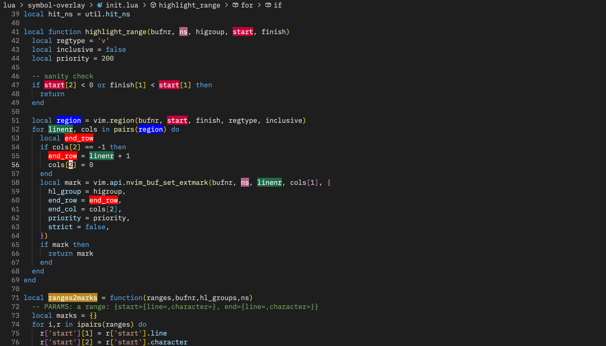

# Introduction
This is a neovim plugin for highlighting symbols with overlays. 
Highlights will be updated automatically along with edits.
It depends on [neovim-lspconfig](https://github.com/neovim/nvim-lspconfig) and [telescope.nvim](https://github.com/nvim-telescope/telescope.nvim)(optional).

# Usage


## Toggle highlight under cursor
`:lua require('symbol-overlay').toggle()` or press `<C-t>t` by default.

## Add highlights in batch
For this to work, telescope.nvim is needed
`:Telescope symbol_overlay gen` or press `<C-t>g` by default.

## List highglights and goto
For this to work, telescope.nvim is needed
`:Telescope symbol_overlay list` or press `<C-t>l` by default.

## Clear all highlights
`:lua require('symbol-overlay').clear_all()` or press `<C-t>c` by default.

## goto next/prev highlight
`:lua require('symbol-overlay').next_highlight()` / `:lua require('symbol-overlay').prev_highlight()`

or press `<C-t>n`/ `<C-t>p` by default.

# Install
By [lazy.nvim](https://github.com/folke/lazy.nvim):
```lua
{
    'hek14/symbol-overlay.nvim'
    dependencies = { "neovim/neovim-lspconfig" }, -- add telescope.nvim if you want to use batch mode
    event = 'BufRead',
    config = function ()
      require('symbol-overlay').setup()
      require'telescope'.load_extension('symbol_overlay') -- comment this if you don't have telescope installed
    end
}
```

# Config
```lua
require('symbol-overlay').setup({
    colors = {
          "#1F6C4A",
          '#0000ff',
          "#C70039",
          '#ffa724',
          "#b16286",
          "#d79921",
          "#d65d0e",
          "#458588",
          '#aeee00',
          '#ff0000',
          '#b88823',
          "#a89984",
          '#ff2c4b'
      },
    keymap = {
          toggle = '<C-t>t',
          clear_all = '<C-t>c',
          next_highlight = '<C-t>n',
          prev_highlight = '<C-t>p',
          gen = '<C-t>g',
          list = '<C-t>l',
      }
  })
```

# design
Use namespaces for batch deletion/updating of a set of highlights.

# TODO
- add treesitter backend (maybe)
- scope-limited search in batch mode, like `Telescope symbol_overlay gen @function ".*setup.*"`
